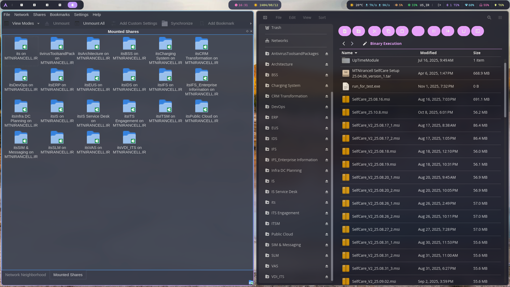

# 🧭 Effortless Access to Windows Shares on Linux — with Smb4K and My Codex-Built File Manager

*November 2025 · Linux · Samba · Hyperland · Rust · Codex*



In many enterprise environments — like ours at **MTN Irancell** — the infrastructure revolves around **Microsoft technologies**:
Active Directory, Windows file shares, and Samba services.
For Linux users, these can feel like unfriendly territory.

Mounting a corporate share often works in **Dolphin** or **Files**, but only halfway:

- Files copy as `.part` first, then rename (and sometimes fail halfway).
- Shares aren’t mounted **globally**, so many apps can’t see them.
- You may have **write access** but not **modify access**.
- And once you reboot or re-login — poof, the share is gone.

## 😣 I’ve Been There

I’ve spent countless hours trying to make these shares behave properly on Linux.
Even with Dolphin’s “Network → SMB” integration, things never felt native.
That’s when I remembered a little KDE tool from the KDE 3 era — **Smb4K** — and decided to give it a second life on my **Hyperland** desktop.

---

## 💎 Enter Smb4K — The Hidden Gem of Network Shares

Smb4K is a **powerful, KDE-native Samba browser and mounter** that turns those flaky `smb://` connections into **proper mounted directories** your whole system can use.

### 🛠️ Install It

```bash
# Arch / Manjaro
sudo pacman -S smb4k

# Ubuntu / Debian
sudo apt install smb4k

# Fedora / Rocky Linux
sudo dnf install smb4k
```

### 🚀 How It Works

1. Launch **Smb4K** → it automatically discovers all SMB hosts.
2. Log in with your **domain credentials** (`MTNIRANCELL\your.username`).
3. Browse your shares (`itsEUS`, `itsITS`, `itsVDI_ITS`, etc.).
4. Click **Mount** → it’s now available system-wide, not just in Dolphin.
5. Bookmark your favorite ones, and next time just click once — boom, everything’s mounted.

Smb4K mounts under `/run/user/.../smb4k/...`, fully integrated into your file system.

---

## 🧩 Why It’s a Game-Changer

| Feature                                   | Dolphin smb:// | Smb4K Mount |
| ----------------------------------------- | -------------- | ----------- |
| Global mount visible to all apps          | ❌              | ✅           |
| Full read/write/modify access             | ⚠️ Sometimes   | ✅ Always    |
| Persistent bookmarks                      | ❌              | ✅           |
| Works in terminals & scripts              | ❌              | ✅           |
| Reliable for big files (e.g., .msi, .tar) | ⚠️             | ✅           |

I copied large **SelfCare MSI packages** (for our internal app) directly from my mounted shares — no `.part` mess, no permission errors, and every subdirectory was instantly visible, exactly as you see in the screenshot.

---

## 🦊 Forking Cosmic-Files: From God File to Design Patterns

On the right side of that screenshot you’ll notice a **modern, sleek file manager**.
That isn’t Dolphin — it’s my **Cosmic-Files fork** that I’ve been rebuilding with **Codex** as my favourite Rust teammate.

The upstream project had a single `app.rs` god file juggling window state, I/O, theming, and terminal integration.  
I split it apart like a pro dev:

- `common/` now owns shared constants and typed records.
- `core/` handles operations, navigation, mounts, and terminal sessions.
- `utils/` groups clipboard helpers, archive tools, and theme managers.
- `views/` and `widgets/` focus purely on UI components.

That refactor unlocked a proper set of design patterns instead of a tangle of match arms:

- **Adapter** for bridging GVFS mount backends with the UI command palette.
- **Facade** in `core::operations::controller` so commands like copy, diff, or mount feel like a single cohesive API.
- **Strategy** powering the terminal integration — swapping between shell profiles without cluttering the main event loop.
- **Observer-inspired messaging** inside `core::navigation` to keep tabs, breadcrumbs, and quick access drawers in sync.

Codex handled the migrations with surprising empathy.  
I’d describe the current state, share a module tree, and the model would draft the glue code plus doc comments that made the architecture click.

The result?

- 🧭 **Top toolbar** with modern circular icons and quick actions.
- 🔍 **Integrated fuzzy search** next to the path bar.
- 🎨 **Unified Dracula-inspired theme**, auto-syncing with Hyperland and Plasma 6.
- ⚡ **Optimized async directory loading**, so even `/run/user/.../smb4k` feels instant.
- 🧠 **AI-assisted evolution** that reads more like a mature Rust codebase than a weekend experiment.

---

## 🧠 Smb4K + My File Manager = Perfect Workflow

When I mount a share in Smb4K, it instantly appears inside my file manager.
Because both are KDE/Qt-aware and system-mounted, there’s zero compatibility issue — I can drag-and-drop MSI builds, edit configs, or run installers directly.

This combination finally gave me what I’d wanted for years:

> A **Windows-like SMB experience** on Linux, without hacks, without terminal mounts — just clean, reliable integration.

---

## 🌞 The Takeaway

For Linux power users and sysadmins in corporate environments,
**Smb4K + a good file manager = peace of mind.**

If you’re using **Hyperland, Plasma, or Sunlight OS**, give this combo a try:

1. Use **Smb4K** for mounting and managing network shares.
2. Pair it with your favourite modern file manager (or build your own, like I did, with Codex’s help).

Now, every Monday morning when I need to access `\\MTNIRANCELL.IR\itsEUS`,
I just open Smb4K → click **Bookmarks** → and everything mounts instantly.
Then I open my **Codex-powered file manager**, and I’m home. 🦊💜🐧
