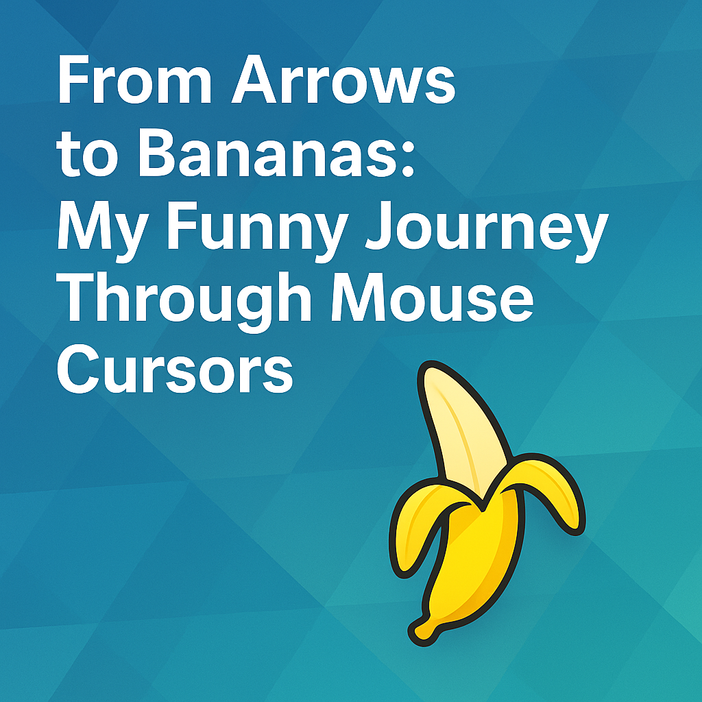

# 🍌 From Arrows to Bananas: My Funny Journey Through Mouse Cursors



There's something quietly beautiful about the humble **mouse cursor** — that tiny arrow we move across our screens thousands of times a day.
It's one of the oldest digital companions we have, yet we rarely stop to notice it.

Until, of course… you replace it with a **banana**. 🍌

---

## 🖱️ My Journey with Cursors

When I first started using computers, I didn't think much about cursors.
I used the **classic Windows pointer**, and to be honest, it's still one of the most perfect designs ever made — sharp, visible, elegant, and minimal.
No matter what OS I switched to — Linux, KDE, GNOME — I always found myself downloading that familiar Windows-style cursor pack.

Then came **Ubuntu 10.04** and **GNOME 2**, and I switched to the **XP cursor**. After that, I used the **Aero cursor**, which looked so smooth and futuristic at the time.

Later, I discovered **SharXhan**, a macOS-inspired set — tiny, black, and sleek, with a rainbow-like busy spinner.
Then came **Breeze**, KDE's official cursor theme — clean, simple, modern.
It felt native, like it belonged to Plasma.

But one day, while browsing for fun cursor themes, I stumbled upon something hilarious and oddly perfect:
👉 **Banana Cursor**.

Yes — the pointer looks like a half-peeled banana, ready to eat.
It's bright, cheerful, and just… *happy*.

Every time I move it, I can't help but smile.
Technology doesn't have to be serious all the time — sometimes it should be **fun**.

---

## 🍌 The Story Behind Fun Cursors

Finding the banana cursor wasn't just a happy accident — it was a reminder.

For years, I'd been chasing "the perfect setup" — the optimal theme, the most efficient keybinds, the cleanest UI.
I treated my Linux desktop like a high-performance machine where every pixel mattered.
And it does. But somewhere along the way, I forgot that **computers are tools for humans**, not vice versa.

A cursor is one of the few things in computing that's purely about user experience.
It doesn't make your code faster. It doesn't improve your algorithms.
It just sits there, moving when you move your mouse, waiting for your next click.

And yet — it's the *most visible thing on your screen*.

So why not make it fun?

That's when I realized: **the best design is the one that makes you smile every time you use it**.

---

## 🎨 Why Do We Have So Many Cursor Styles?

Cursors are more than decoration — they're part of how humans communicate with computers.
Every shape has a story and a purpose:

| Cursor Type                                   | Example Use                | Meaning                            |
| --------------------------------------------- | -------------------------- | ---------------------------------- |
| **Arrow (Pointer)**                           | Default                    | Clickable objects, UI navigation   |
| **I-Beam**                                    | Text area                  | Indicates typing or selection area |
| **Hand**                                      | Links / clickable elements | Actionable item                    |
| **Busy (Spinner, Hourglass)**                 | Background process         | "Wait a sec..."                    |
| **Busy Banana** 🍌                            | Background process         | "Waiting with a smile!"            |
| **Crosshair**                                 | Drawing / precision tools  | Exact point selection              |
| **Resize Arrows**                             | Window edges               | Adjusting dimensions               |
| **Hidden / Invisible**                        | Fullscreen video / gaming  | Immersion                          |

Each shape exists to **reduce confusion** and **improve feedback** — a visual language of interaction.

---

## 🧠 The Art & Psychology Behind Cursor Design

Cursor design is an intersection of **UX design** and **micro-psychology**.
They must be instantly recognizable, visible against all backgrounds, and feel "right" in motion.

### Visibility & Contrast
* **White or light outlines** improve visibility on dark UIs
* **High contrast edges** make cursors stick out without being garish
* **Size matters** — too small and you lose it on 4K screens, too large and it's annoying

### Motion & Feedback
* **Subtle animations** in busy states make waiting less frustrating
* **Smooth easing** in pointer movement feels more natural
* **Responsive feedback** (like cursor changing on hover) communicates affordance

### Personality & Emotion
* **Fun shapes** add personality and break monotony
* **Contextual cursors** make the interface feel alive and responsive
* **Easter eggs** (like bananas) create moments of delight

When I use my banana cursor, it breaks the seriousness of work.
It reminds me that even in serious coding, automation, or design — joy can be part of the workflow.
And it costs nothing. It doesn't slow me down. It just… makes me happy.

---

## 🌍 Cursor Themes Across Operating Systems

Over the years, I've noticed how each OS has its own cursor philosophy:

### Windows
- Started with simple, pixelated arrows (Windows 95)
- Evolved to smooth anti-aliased cursors (Windows XP)
- Became sleek and modern (Windows 7 Aero)
- Now features optional fluent design cursors

### macOS
- Always favored minimalism — tiny, elegant, black
- The spinning beach ball of death is iconic (infamous, really 😅)
- Very little customization available

### Linux / KDE
- Breeze is gorgeous — modern, clean, KDE-native
- Oxygen before it was equally well-designed
- Community themes are incredibly creative (hence the banana!)
- Full customization available

---

## 🧠 Fun Fact: How Many Cursors Actually Exist?

You might be surprised — there are **dozens of cursor roles** defined in modern operating systems.
In Windows or X11-based Linux, the cursor theme can include more than **60 different cursor files**, for every possible state:

- `default` — standard pointer
- `pointer` — link / clickable
- `text` — text selection
- `wait` — busy (hourglass)
- `progress` — background work (spinning)
- `move` — draggable object
- `n-resize, e-resize, se-resize, etc.` — 8 directions of resizing
- `nesw-resize` — diagonal resize
- `not-allowed` — forbidden action
- `grab` — draggable but not held
- `grabbing` — actively dragging
- `help` — help information available
- `crosshair` — precise selection

And yes, you can customize *every single one* of them.
That's how deep cursor culture goes!

---

## 💡 Why It Matters: The Philosophy of Details

In a world obsessed with high-resolution icons and complex animations, cursors are tiny yet powerful reminders of **interaction purity**.
They're the bridge between our thoughts and our digital actions.
Changing one can change your mood, your focus — even your day.

I often tell people: **"You're looking at your cursor thousands of times a day. Why not make it beautiful or fun?"**

Most people have never customized their cursor. They just accept the default.
And that's okay — defaults are good.

But when you realize you *can* change it, that you have agency over your entire desktop experience down to the pixel level — that's when things get fun.

That's when you choose a banana.

---

## 🪄 How to Use Fun Cursors on Arch Linux (and Other Systems)

### Arch Linux / KDE Plasma (My Setup)
1. Go to **System Settings → Appearance → Cursors**
2. Click **Get New Cursors** to browse community themes
3. Or download manually from OpenDesktop and place in `~/.icons/cursor-theme-name`
4. Select your theme and click **Apply**

### GNOME
1. Go to **Settings → Appearance → Cursor**
2. Select from available themes
3. For custom themes, place cursor files in `~/.local/share/icons/`

### Manual Installation (for Linux nerds)
```bash
# Download cursor theme
cd ~/.icons
mkdir my-cursor-theme

# Place cursor PNG/SVF files and index.theme configuration
# Then select from your DE settings
```

### Windows
- Control Panel → Mouse → Pointers tab
- Browse available schemes or download from cursor websites

### macOS
- macOS doesn't allow easy cursor customization
- Third-party apps like *Cursor Pro* exist but have limitations

---

## ✨ The Personal Impact

It started with a classic arrow, evolved through Aero and Breeze, and ended with a banana.
That's the beauty of open systems and digital creativity — we can shape our experience down to the smallest detail.

Every time I move my cursor, I see that yellow-green banana, and I smile.
It's a tiny thing. Objectively pointless.
But it makes my day a little warmer, my work a little lighter, and my screen a little more *me*.

If you haven't tried changing your cursor lately, maybe it's time to add a bit of 🍌 joy to your screen too.

---

## 🎯 What's Your Cursor Story?

I'm genuinely curious — what cursor do you use?
Are you still rocking the Windows 11 default? Did you ever customize it?
Or do you, like me, believe that computers should bring joy along with productivity?

Drop a comment or reach out on social media.
Let's celebrate the humble mouse cursor together.

---

**Tags: #CursorLife #LinuxCustomization #BananaCursor #KDE #UXDesign #DesktopRicing #OpenSource**

---

**Next time:** More on "ricing" your Arch Linux desktop — we'll talk about wallpapers, themes, and the philosophy of making your desktop feel *alive*.

Stay geeky. Stay fun. 🍌✨
