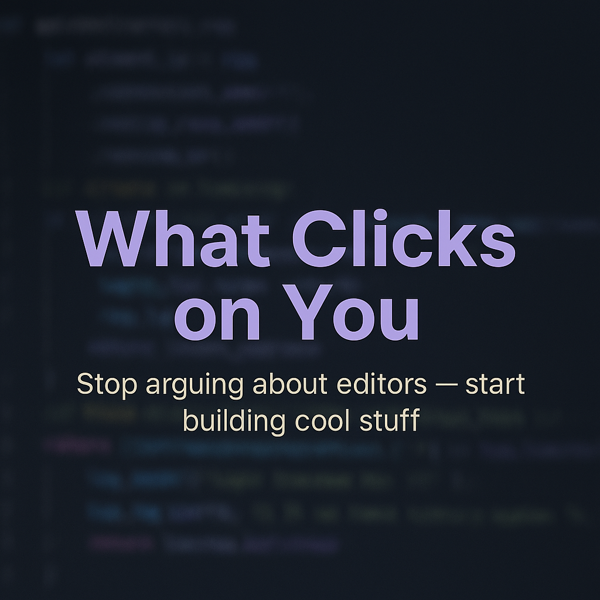

# 💻 What Clicks on You: The Real Truth About Developer Tools

**Stop arguing about editors — start building cool stuff.**

---

### 🎨 1. It's Not a Competition — It's a Palette

Every developer has their own rhythm.
Some find flow in **NeoVim's modal world**, others think better inside **Cursor's AI zone**, some trust **VSCode's universality**, and others live happily in **JetBrains' heavy IDEs**.

There's no "superior" editor.
There's only the one that *clicks* on you — the one that fades away and lets your mind meet the code.

---

### 🧠 2. Tools Don't Make You Smarter

You can write elegant code in Notepad and awful code in VSCode.
You can build an entire product in **Zed** or **Emacs** — it doesn't matter.

Productivity isn't about plugins or keybindings.
It's about how *you* think, structure, and focus.

If **VSCode** helps you deliver faster — use it.
If **NeoVim** helps you stay sharp — use it.
If **JetBrains** makes debugging effortless — use it.
If **Zed** makes you forget time — that's your editor.

---

### ⚙️ 3. The New Era — AI in the Editor

Welcome to 2025: your IDE isn't just syntax highlighting, it's *intelligence amplification*.

* **Cursor** understands your intent and rewrites whole features.
* **Zed** talks to multiple AI models via MCP.
* **VSCode** runs **Copilot**, **Gemini**, or **Claude** right beside your code.

The best developers aren't fighting over tools anymore —
they're *training their AI copilots* to fit their style.

---

### 📺 4. The YouTuber Illusion

Don't get trapped by aesthetics.
Yes, that NeoVim setup with animated borders and glowing cursors looks amazing —
but many of those same creators quietly open **Cursor** or **Zed** when deadlines hit.

Coding isn't a movie scene.
It's craftsmanship.
Nobody earns a raise for having the most colorful config file.

---

### 🪶 5. The Best Tool Is the One You Don't Notice

When your editor disappears, you've found the right one.
That's the *Zen state* of development — where it's just **you and the idea**.

When Zed in full-screen,
or NeoVim in a clean terminal,
or VSCode in Zen Mode
makes you lose sense of time — that's it.
That's *what clicks on you.*

---

### 🧩 6. The Power of Competition

Let's celebrate the ecosystem:

| Editor                | Strength                             | Vibe                   |
| :-------------------- | :----------------------------------- | :--------------------- |
| 🦀 **Zed**            | GPU-native, Rust-fast, minimal UI    | "Coding as meditation" |
| 🤖 **Cursor**         | Deep AI integration, model switching | "AI as a teammate"     |
| 🧠 **VSCode**         | Mature, extensible, universal        | "The all-rounder"      |
| ⚡ **NeoVim**          | Lightweight, fully customizable      | "Precision & purity"   |
| 🏢 **JetBrains IDEs** | Refactoring, enterprise-ready        | "When scale matters"   |

Competition doesn't divide us —
it evolves the craft.

---

### 💡 7. What Clicks on You

Don't use what trends.
Don't copy what influencers preach.
Just pick what *clicks* on you.

You're not a "VSCode dev" or a "Vim dev."
You're just a **developer** — and that's powerful enough.

---

🧋 *Written by a developer who uses Zed, Cursor, VSCode, and sometimes Vim — all in the same week.*
🪶 *Because code is about creation, not conversion.*
